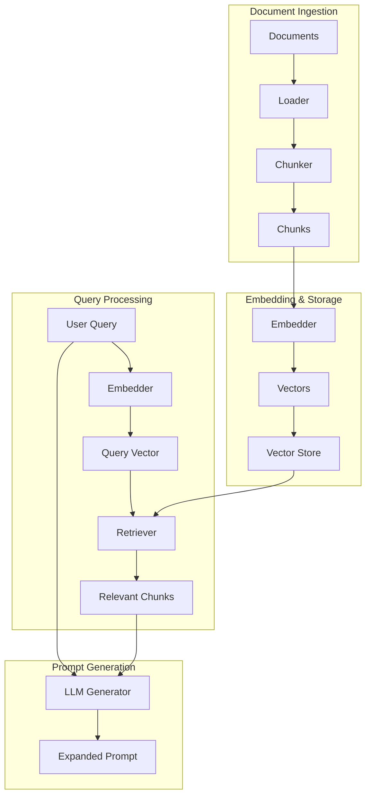

# Core Concepts

Understanding the key concepts behind Prompt Amplifier.

## What is Prompt Amplification?

**Prompt Amplification** is the process of transforming short, ambiguous user inputs into detailed, structured prompts that LLMs can execute effectively.

### The Problem

Users often provide vague prompts:

- ❌ "How's the project going?"
- ❌ "Summarize the data"
- ❌ "Help me with this"

LLMs struggle to provide useful responses without:

- Context about what "project" or "data" refers to
- Understanding of what metrics matter
- Knowledge of the expected output format

### The Solution

Prompt Amplifier uses your **knowledge base** to:

1. Understand the user's intent
2. Retrieve relevant context
3. Generate a comprehensive prompt

```
User Input: "How's the deal going?"
                    ↓
        [Knowledge Base Search]
                    ↓
          [Context Retrieval]
                    ↓
         [Prompt Generation]
                    ↓
Expanded Prompt: "Generate a Deal Health Assessment report with 
                 the following structure:
                 1. Executive Summary...
                 2. Key Metrics Table...
                 3. Risk Factors...
                 ..."
```

## Architecture



## Key Components

### 1. Documents & Loaders

**Documents** are your knowledge base - files containing information that provides context.

**Loaders** read different file formats:

| Loader | Formats | Use Case |
|--------|---------|----------|
| `TxtLoader` | `.txt` | Plain text |
| `PDFLoader` | `.pdf` | Documents, reports |
| `DocxLoader` | `.docx` | Word documents |
| `CSVLoader` | `.csv` | Structured data |
| `JSONLoader` | `.json` | API responses |
| `ExcelLoader` | `.xlsx` | Spreadsheets |

### 2. Chunkers

**Chunkers** split documents into smaller pieces for efficient retrieval.

```python
Document: "This is a long document with many paragraphs..."
              ↓ Chunker
Chunks: ["This is a long...", "...document with...", "...many paragraphs"]
```

**Why chunk?**

- Embeddings have token limits
- Smaller chunks = more precise retrieval
- Overlapping chunks preserve context

### 3. Embedders

**Embedders** convert text into numerical vectors (embeddings).

```python
Text: "Customer satisfaction increased"
              ↓ Embedder
Vector: [0.12, -0.45, 0.78, ..., 0.23]  # 384 dimensions
```

**Types:**

| Type | Examples | Pros | Cons |
|------|----------|------|------|
| **Sparse** | TF-IDF, BM25 | Fast, exact matches | No semantic understanding |
| **Dense** | Sentence Transformers, OpenAI | Semantic understanding | Slower, may need API |

### 4. Vector Stores

**Vector Stores** persist embeddings for efficient similarity search.

```python
# Add embeddings
store.add(chunks, embeddings)

# Search for similar
results = store.search(query_embedding, k=5)
```

**Options:**

| Store | Type | Persistence | Best For |
|-------|------|-------------|----------|
| `MemoryStore` | In-memory | No | Testing |
| `ChromaStore` | Local DB | Yes | Development |
| `FAISSStore` | Local index | Yes | Large datasets |

### 5. Retrievers

**Retrievers** find relevant chunks for a given query.

```python
query = "deal health"
results = retriever.retrieve(query, k=5)
# Returns top 5 most relevant chunks
```

**Strategies:**

| Strategy | How it Works | Best For |
|----------|--------------|----------|
| **Vector** | Cosine similarity | General queries |
| **Hybrid** | BM25 + Vector | Keyword + semantic |
| **MMR** | Diversity-optimized | Varied results |

### 6. Generators

**Generators** use LLMs to create expanded prompts from context.

```python
generator.generate(
    query="deal health",
    context=[chunk1, chunk2, chunk3]
)
# Returns detailed prompt
```

**Providers:**

| Provider | Models | Quality | Cost |
|----------|--------|---------|------|
| OpenAI | GPT-4o, GPT-4o-mini | Excellent | $$ |
| Anthropic | Claude 3.5, Claude 3 | Excellent | $$ |
| Google | Gemini 2.0, Gemini 1.5 | Very Good | $ |

## Data Flow

### 1. Ingestion Flow

```
PDF/DOCX/CSV → Loader → Document → Chunker → Chunks → Embedder → Vectors → Store
```

### 2. Query Flow

```
User Query → Embedder → Query Vector → Retriever → Top-K Chunks → Generator → Expanded Prompt
```

## Key Metrics

### Expansion Ratio

How much the prompt was expanded:

```python
ratio = len(expanded_prompt) / len(original_prompt)
# e.g., 50x means the output is 50 times longer
```

### Retrieval Score

Similarity between query and retrieved chunks (0-1):

- `> 0.7` = Highly relevant
- `0.5 - 0.7` = Somewhat relevant
- `< 0.5` = Low relevance

### Generation Time

Time to generate the expanded prompt:

- OpenAI: ~2-5 seconds
- Anthropic: ~1-3 seconds
- Google: ~2-4 seconds

## Best Practices

### 1. Quality Knowledge Base

- Use relevant, up-to-date documents
- Include examples of good prompts
- Cover different scenarios

### 2. Appropriate Chunk Size

- Too small: loses context
- Too large: retrieves irrelevant info
- Sweet spot: 256-512 characters

### 3. Choose the Right Embedder

- **TF-IDF**: Fast, good for exact keywords
- **Sentence Transformers**: Best free option
- **OpenAI**: Highest quality, but costs money

### 4. Use Persistent Storage

For production, always use ChromaDB or FAISS:

```python
vectorstore=ChromaStore(
    collection_name="prod_docs",
    persist_directory="/data/embeddings"
)
```

## Next Steps

- [Embedders Guide](embedders.md) - Deep dive into embedders
- [Vector Stores Guide](vectorstores.md) - Storage options
- [Retrieval Guide](retrieval.md) - Retrieval strategies

