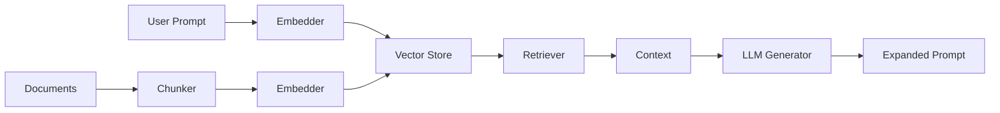

# Prompt Amplifier 🔨

<div align="center">
  <strong>Transform short prompts into detailed, structured instructions using RAG</strong>
</div>

<p align="center">
  <a href="https://pypi.org/project/prompt-amplifier/">
    
  </a>
  <a href="https://www.python.org/downloads/">
    
  </a>
  <a href="https://opensource.org/licenses/Apache-2.0">
    
  </a>
  <a href="https://github.com/DeccanX/Prompt-Amplifier/actions">
    
  </a>
</p>

---

## What is Prompt Amplifier?

**Prompt Amplifier** is a Python library for **Prompt Amplification** — the process of transforming short, ambiguous user intents into comprehensive, well-structured prompts that LLMs can execute effectively.

### The Problem

When users interact with LLMs, they often provide vague, incomplete prompts:

> *"How's the deal going?"*

LLMs struggle to provide useful responses without context about what "deal" means, what metrics matter, or what format the response should take.

### The Solution

Prompt Amplifier uses **Retrieval-Augmented Generation (RAG)** to:

1. 📚 **Retrieve** relevant context from your knowledge base
2. 🔍 **Understand** the user's intent
3. ✨ **Generate** a detailed, structured prompt

```python
from prompt_amplifier import PromptForge

forge = PromptForge()
forge.add_texts([
    "POC Health: Healthy means all milestones on track.",
    "Key metrics: Winscore 0-100, Feature fit %, Engagement score.",
])

# Short, vague input
result = forge.expand("How's the deal going?")
print(result.prompt)
```

**Output:**
```markdown
**GOAL:** Generate a Deal Health Assessment report

**REQUIRED SECTIONS:**
1. Executive Summary - Overall health status (Healthy/Warning/Critical)
2. Key Metrics Table
   | Metric | Current | Target | Status |
   |--------|---------|--------|--------|
   | Winscore | ... | 80+ | ... |
   | Feature Fit | ... | 90%+ | ... |
3. Risk Factors
4. Recommended Actions

**INSTRUCTIONS:**
- Use data from Deal Profile and Success Plan
- Assess POC health based on milestone completion
...
```

---

## Key Features

<div class="grid cards" markdown>

- :material-file-document-multiple: **Multi-format Document Loading**
  
    Load PDF, DOCX, Excel, CSV, TXT, JSON files seamlessly

- :material-vector-point: **Pluggable Embedders**
  
    TF-IDF, BM25, Sentence Transformers, OpenAI, Google

- :material-database: **Vector Store Support**
  
    In-memory, ChromaDB, FAISS for persistent storage

- :material-magnify: **Smart Retrieval**
  
    Vector search, hybrid (BM25 + Vector), MMR

- :material-robot: **Multiple LLM Backends**
  
    OpenAI, Anthropic Claude, Google Gemini

- :material-puzzle: **Fully Extensible**
  
    Easy to add custom loaders, embedders, and stores

</div>

---

## Quick Start

### Installation

```bash
pip install prompt-amplifier
```

### Basic Usage

```python
from prompt_amplifier import PromptForge

# Initialize
forge = PromptForge()

# Add your knowledge base
forge.add_texts([
    "Customer satisfaction rate is 4.5/5 stars.",
    "Sales increased 15% this quarter.",
    "New product launch exceeded expectations.",
])

# Expand a short prompt
result = forge.expand("Summarize performance")

print(result.prompt)
print(f"Expansion: {result.expansion_ratio:.1f}x")
```

### With Persistent Storage

```python
from prompt_amplifier import PromptForge
from prompt_amplifier.vectorstores import ChromaStore
from prompt_amplifier.embedders import SentenceTransformerEmbedder

forge = PromptForge(
    embedder=SentenceTransformerEmbedder(),
    vectorstore=ChromaStore(
        collection_name="my_docs",
        persist_directory="./db"
    )
)

# Load once, use forever
forge.load_documents("./docs/")
result = forge.expand("Project status")
```

---

## Architecture



---

## Comparison

| Feature | Prompt Amplifier | LangChain | LlamaIndex |
|---------|-----------------|-----------|------------|
| **Focus** | Prompt expansion | General chains | Data indexing |
| **Complexity** | Simple API | Complex | Moderate |
| **Dependencies** | Minimal | Heavy | Heavy |
| **Learning Curve** | Low | High | Medium |
| **Use Case** | Prompt engineering | Everything | RAG/Search |

---

## Who Should Use This?

- 🏢 **Enterprise Teams** building internal AI tools
- 🔬 **Researchers** studying prompt engineering
- 👨‍💻 **Developers** creating chatbots and assistants
- 📊 **Analysts** automating report generation

---

## Next Steps

<div class="grid cards" markdown>

- :material-rocket-launch: **[Quick Start Guide](getting-started/quickstart.md)**
  
    Get up and running in 5 minutes

- :material-book-open-variant: **[User Guide](guide/concepts.md)**
  
    Learn the core concepts

- :material-code-tags: **[API Reference](api/promptforge.md)**
  
    Detailed API documentation

- :material-school: **[Tutorials](tutorials/sales-intelligence.md)**
  
    Real-world examples

</div>

---

## License

Apache 2.0 - See [LICENSE](https://github.com/DeccanX/Prompt-Amplifier/blob/main/LICENSE) for details.

---

<div align="center">
  <strong>Made with ❤️ by Rajesh More for the AI community</strong>
</div>
